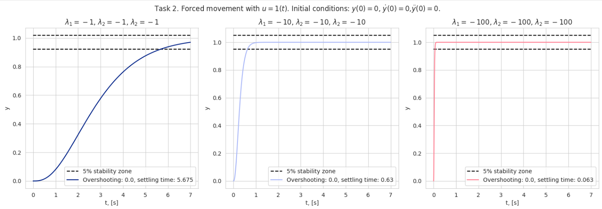

# Automatic-Control-Theory

 

This course delves into the second semester of Automatic Control Theory for the year 2024 at ITMO University. You can explore the course structure on [Notion](https://tranquil-geese-65e.notion.site/2023-24-2-2d3385312e354729be8e0fa4f4ebdffb).


<div style="border: 1px solid #999; padding: 10px; border-radius: 5px;">
    
</div>

# Table of contents

```text
Automatic-Control-Theory/
│
├── docs/                           # Directory for documentation
│
├── LICENSE                         # License file
├── README.md                       # Project description and instructions
├── requirements.txt                # Python dependencies list for pip
│
└── src/                            # Source code directory
    ├── homework/                  # Directory for homework materials
    └── practice/                   # Directory for practice materials

```

# Installation
```bash
pip install -r requirements.txt
```

# Contact 
You can find me in telegram [@dimkablin](https://t.me/dimkablin).
Feel free to open an issue or submit a pull request.
